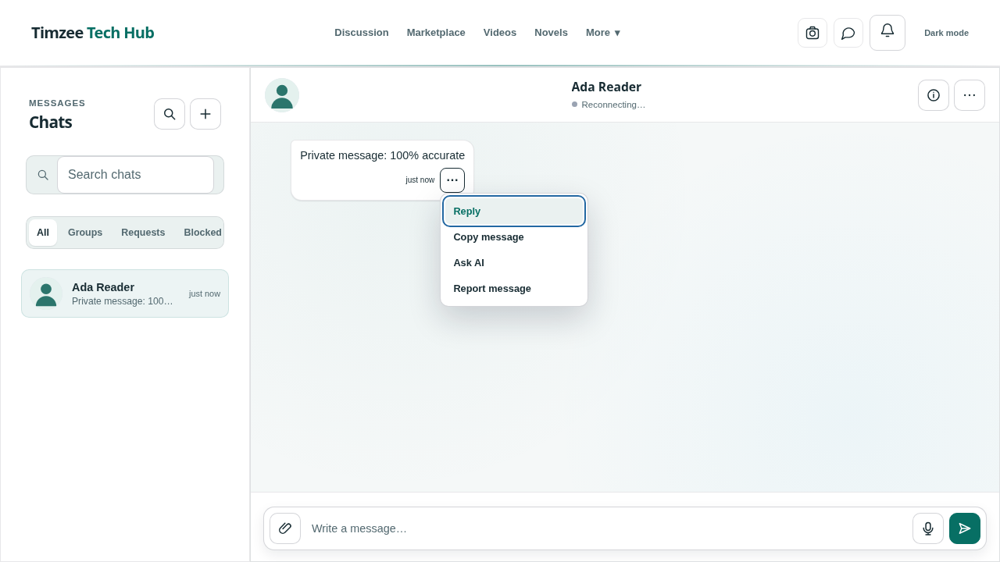

# Private media and message actions review — 9 October 2026

This pass extends the [sitewide review](sitewide-review-2026-10-08.md) and [chat reliability review](chat-reliability-review-2026-10-08.md), in the existing draft [PR #3](https://github.com/Timzee00/timzee-tech-blog/pull/3). Production remains locked. No database migration, policy change or live data mutation was performed.

## Repairs

### Private attachment requests

Previously, every expired attachment element independently called the signing function. A message, a shared-media thumbnail and a subsequent rerender could each pay for another authenticated request for the same file. A late response could also overwrite an element whose attachment had changed.

`media.js` now uses a memory-only signing cache with one in-flight request per path and session. It allows at most four concurrent signing requests, keeps at most 128 settled entries, and reuses a valid result for at most 60 seconds. It does not persist credentials or signed URLs. Token changes and logout clear settled entries, reject queued work and invalidate pending results. The existing server authorization checks still run on every cache miss. Signing fetches time out after 15 seconds, so a stalled request cannot permanently occupy a slot.

The cache rejects malformed or nearly expired responses and does not retain failures. Refresh completion checks that the DOM element still has the original source; if it changed, the new source is refreshed separately. Removed the unused client TTL constant.

These are client request bounds, not a global server quota. Already issued bearer URLs remain usable until their server expiry; clearing this cache is not immediate revocation of those URLs. The legacy public-media migration remains outstanding.

### Conversation layout and details

Visual inspection exposed a collapsed desktop workspace: the closed details sidebar still occupied a second grid row. It now uses a native dialog, so it consumes no grid space when closed and provides modal focus containment and Escape/focus return when open. Author/group profile fields are populated; group editing is shown only to the owner. Explicit message-area grid rows keep the older-history button from taking the flexible message space. Tests assert that the conversation fills the workspace and that the history button stays compact.

Removed unconnected Remove, Block and View all controls from the details panel. Existing backend blocking rules and the blocked-contacts list are unchanged; this change does not claim to implement a new blocking workflow. Shared media is accurately labeled as recent. Local user/group placeholders replace arbitrary external stock portraits for missing avatars, eliminating those default image requests.

### Message actions

Each message now exposes a visible, named action button. The menu supports Enter, Shift+F10/context-menu key, Arrow Up/Down, Home, End, Escape and Tab. Opening moves focus into the menu; Escape restores the trigger. Its expanded state is exposed to assistive technology. A message replaced during a rerender closes its menu, preventing an action on a stale DOM selection. Pointer context menus and touch long-press remain available; ordinary mouse presses no longer trigger long-press handling.

Reply text identifies the actual author and preserves line breaks. Clipboard operations show success only after the write succeeds; missing clipboard access produces actionable error feedback. The message metadata row no longer fades its entire contents, keeping the new control readable.

### Selected chat text sent to the assistant

“Ask AI” previously placed the private message body in a `?context=` URL, exposing it to navigation history and potential request logs. It now stores a user-bound, single-use handoff in this tab's session storage and navigates with a random reference. The assistant consumes and deletes the handoff; it rejects another user's reference or a handoff older than five minutes. Context is bounded to 12,000 characters, and storage failures stop navigation with an error. Interrupted expired handoffs are cleaned when another is created.

The assistant still respects the disabled context preference, does not replace text already being typed, and only prefills the composer. The user must send the prompt. Existing legacy context URLs are cleaned before asynchronous loading; percent-encoded text is no longer decoded twice. New chat actions do not put message content in a URL. Session storage is same-origin browser storage, not an encrypted vault, and this change cannot remove historical URLs from external logs.

## Verification

On Node 22, the production build, **107 JavaScript/inline syntax checks**, **58 unit/backend/SQL tests** and the full **190-case Chromium desktop/mobile suite** passed. After the final details-panel spacing adjustment, the relevant browser suites were rerun (36 cases). `npm audit` reported **0 known vulnerabilities**; `git diff --check` passed. This pass adds nine unit tests and twenty browser cases, plus stronger history-layout assertions.

The strict static design audit reports **234 `affordance.actionless-button` findings**, with no other rule categories or unresolved ownership findings. As described in the earlier review, that rule does not resolve external/delegated event listeners. The [nonzero audit result](review-assets/ui-static-audit-2026-10-09.json) is retained; this is not presented as a passing static certification.

New coverage includes:

- Unit tests for duplicate signing, session invalidation, failure/retry, expiry validation, concurrency, queued cancellation and bounded cache size.
- Unit tests for single-use/user-bound context, expiry cleanup, oversized content and storage failure.
- Desktop/mobile browser cases for keyboard/focus/menu state, stale selected nodes, clipboard failure, multiline replies, private AI navigation and disabled preferences.
- Browser cases for duplicate attachment elements/rerenders, a source changed during signing, and recovery after a signing error.

Browser requests use intercepted APIs and synthetic accounts. These cases do not establish live Supabase permissions, media delivery or AI-provider behavior. The existing handler authorization tests remain part of the full suite.

## Visual review

Synthetic local fixtures were used; no production conversations were captured.

[Phone details dialog](review-assets/chat-details-mobile.png)

## Remaining launch limits

The previous reviews' blockers remain: correct live Supabase schema/RLS/Storage verification, legacy public-media migration, large-list pagination and efficient per-thread inbox previews, long-disconnection resynchronization, remote message deletion, staging integrations, measured load/cost limits, restore and rollback evidence. Rebuilding message markup can still interrupt playing media; this pass reduces signing traffic but does not replace that renderer.

GitHub Actions was previously blocked by account billing. Local tests do not replace a hosted release gate after billing is resolved. Review commits include `[skip netlify] [skip ci]` and use the existing Netlify ignore guard. No production unlock or merge is included.
