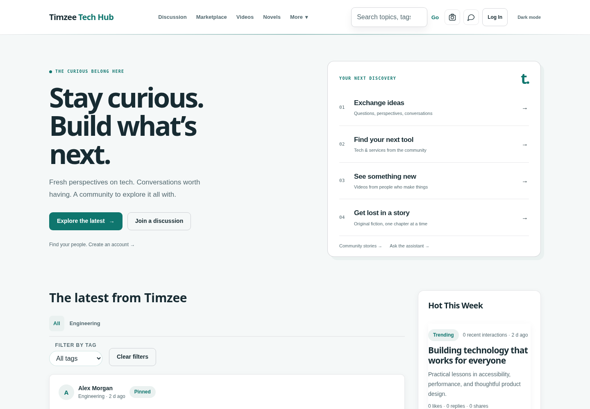

# Sitewide review — 8 October 2026

**Result: substantial source fixes and a coherent interface, ready for review in draft PR #3. Production remains locked. A launch for millions of users is not yet validated.**

Repository: [Timzee00/timzee-tech-blog](https://github.com/Timzee00/timzee-tech-blog). Review: [PR #3](https://github.com/Timzee00/timzee-tech-blog/pull/3). This review extends the [6 October production assessment](production-review-2026-10-06.md). Its maintenance finding is superseded by the safer recurring job described below; its database, operational and capacity blockers remain.

The [chat reliability follow-up](chat-reliability-review-2026-10-08.md) records the subsequent conversation, subscription, discovery and unread-count repairs and their remaining limitations.

## What changed

| Area | Verified problem | Implemented change |
| --- | --- | --- |
| Home and discovery | Repeated promotional tiles, competing visual styles, noisy effects and a removed-element dependency leaving the latest feed on Loading | New editorial introduction and numbered discovery index, clear feed hierarchy, repaired populated feed and useful empty/error states |
| Shared design | Conflicting legacy CSS, inverted staff light-theme colors, low-contrast text and inconsistent controls | Shared teal/navy palette, readable light/dark surfaces, consistent typography, forms, cards, borders and focus treatment; documented ownership in DESIGN.md |
| Phone and tablet layouts | Blanket mobile rules enlarged every span/div and button, clipped labels and overlapped header controls | Removed the conflicting rules; flexible columns, bounded scrolling for tabs/tables and a responsive header/drawer/bottom navigation |
| Navigation | Duplicate or misleading bottom destinations; policy and nested staff links could miss shared behavior | Named SVG icons, correct destinations/current-page state, root-relative shared links; drawer focus containment, inert background and Escape/focus return |
| Loading and motion | A cinematic boot overlay, forced welcome modal, floating theme control and redundant animation competed with content | Immediate content display, inline theme control, brief optional feedback transitions and reduced-motion support |
| Forms and authentication | Browser popups, missing field names, inaccessible inactive auth panels and duplicate submits | Inline validation and first-error focus; password disclosure controls; inert inactive auth panels; busy states, retained drafts and recoverable public-form failure messages |
| Feedback and confirmation | Duplicated toast systems and blocking native confirm/prompt calls | Shared toast and styled HTML dialog owners; confirmations default to Cancel, password prompts mask input, dialogs restore focus |
| Search and filters | Older responses could overwrite newer searches; category/pagination interactions diverged | Debounced, composition-aware search with clear controls; request sequencing; category-aware video/marketplace browsing and retry states |
| Ranking | Mutation observers watched their own rendering and repeatedly refetched rankings | Explicit page-owned ranking updates with stale-result guards; no self-triggered fetch loop |
| Settings and privacy choices | Edits during a save could be lost; cookie preference/measurement choices were conflated | Save the latest queued settings snapshot; independent cookie choices; guest-safe account settings and accessible cookie controls |
| Chat preferences and layout | Composer height ignored navigation; local chat settings diverged from account preferences; compact mode had no effect | Measure navigation height, fit the workspace to the viewport, sync chat settings to account preferences, apply compact spacing; native group/settings dialogs |
| Staff tools | Team/curator tab switching selected the tab button instead of the content panel; interpolated member names were unsafe; generic guide link was unusable | Correct panel targeting, readable theme tokens, escaped member data, keyboard-operable member search results, root-relative profile links and removed dead guide link |
| Runtime/build | Long CSS import waterfall; external fonts; duplicated initialization and obsolete modules | Build-time CSS bundling, system font fallbacks, one shared shell/control owner and removed obsolete implementations |
| Scheduled maintenance | Invalid Storage relation lookup and incomplete reference scans could stop publishing or delete referenced files | Recurring job now only invokes the existing automation RPC. Removed automatic legacy-media migration/deletion; verified no storage scans or writes occur in this handler |

The earlier hardening remains included: allowlisted public build, locked dependencies, locally bundled Supabase/DOMPurify, versioned assets, stricter privileged endpoint checks, bounded JSON/AI handling, chat media authorization, recent-history pagination and serialized sends, SQL syntax repair and CI release checks.

## Cleanup decisions

Removed the unreachable legacy `chat.js`, cinematic boot loader, runtime semantic-label patcher, duplicate UX override stylesheet, unused legacy super-panel implementation and duplicate home ranking/stat rendering. The legacy super-panel URL redirects to the maintained panel.

Removed unsupported announcement/marketplace notification controls and the nonfunctional chat-sound controls. Compact chat and group-tag settings now have visible effects. Existing saved preference fields remain backward compatible. Empty advertising slots stay hidden until configured. No user accounts, database records or production media were deleted.

## Visual evidence

The screenshots use synthetic local content, not production records. Public branding and content configured by the owner can differ from these fixtures.



[Phone homepage](review-assets/home-mobile.png) · [Dark settings](review-assets/settings-dark-mobile.png)

## Verification

Executed on Node **22.23.3**:

- Production configuration and **102 JavaScript/inline-script syntax checks passed**. The final CSS build has no parser warnings.
- **49 unit/handler/security/SQL tests passed**, including all 21 migration files, subscription lifecycle, the maintenance no-storage regression and the Netlify ignore gate.
- **170 Chromium desktop/mobile tests passed**. Every HTML route, selected authenticated flows and the failure cases described below were included.
- **520 local HTML asset/navigation references** resolve to files in the public build; no missing local targets were found.
- `npm audit` reported **0 known vulnerabilities** in the installed dependency tree at review time.
- Visual capture covered 11 representative routes, light/dark themes, and 360px/1440px widths; selected screens are attached. Additional browser assertions cover 320px and 768px widths and a 640px-high chat viewport.
- `git diff --check` passed.
- **Hosted CI is blocked by GitHub account billing.** [Run 37782545010](https://github.com/Timzee00/timzee-tech-blog/actions/runs/37782545010) ended before any step ran (runner ID 0). Its failure annotation states: “The job was not started because your account is locked due to a billing issue.” This is distinct from the passing local checks; the hosted gate must run after the account block is resolved.
- After publishing the review branch, a read-only Netlify check confirmed production deploy `6aac3cddef1b56000836ded5` still points to `4e823e8` and remains **locked**. Changes are in the draft PR and an automatically generated deploy preview, not production.

The repeatable commands are:

```sh
npm ci --ignore-scripts
npm run build
npm test
npx playwright install --with-deps chromium
npx playwright test
npm audit
```

The browser suite checks all 39 HTML entry points at desktop and phone sizes for module errors, missing local assets and horizontal page overflow. It also covers authenticated member/staff layouts, selected WCAG A/AA axe checks in light/dark themes, a 320px phone and tablet, keyboard/focus behavior, inline validation, failed and duplicate submissions, composition/stale searches, queued preference saves, ranking request counts, member-name injection, recent chat history and composer placement. The follow-up adds 16 browser cases for chat selection races, text/file drafts, failed and pending sends, reconnect edits, people discovery, cached filtering and unread totals above the API row cap.

Browser requests are intercepted with synthetic API responses. Functions use fake database/provider clients. These checks do **not** validate live database permissions, delivery providers or throughput. Chromium emulation is not physical-device, WebKit or Firefox coverage. Automated axe checks are not a complete accessibility audit.

The premium design skill's strict static auditor is also run. It reports **237 `affordance.actionless-button` findings**, with no other rule categories or unresolved ownership findings. Its button rule recognizes inline handlers but cannot resolve this project's `addEventListener` and delegated handlers. The [actual nonzero result](review-assets/ui-static-audit.json) is retained, with primary interactions covered by browser tests; no empty handlers are added to silence the audit. This is a tool limitation and remaining manual coverage requirement, not a passing static certification.

## Remaining launch blockers, in priority order

1. **Hosting/CI budget and deliberate release.** The Netlify production lock is intentional. No production unlock or database migration was performed. Netlify automatically created a [review preview](https://deploy-preview-3--timzee-tech-blog.netlify.app) for commit `7d94bf1` despite its `[skip netlify]` marker; `/release.json` confirmed that commit. The preview uses the existing backend and is not an isolated staging environment. GitHub Actions is also blocked before runner startup by an account billing lock. Keep the PR unmerged until hosted CI, staging validation and budget/quotas are ready. Review changes since the old locked release and verify rollback plus `/release.json` for the exact release.
2. **The correct Supabase project and schema.** The earlier review could not access project `duvbcwwprkzzyzikmcol` through the available database connector. Confirm the migration ledger and a replayable schema baseline; review exposed grants, RLS, private Storage and privileged functions with multiple user/role identities. Syntax-valid migration patches do not prove deployed policies or a reproducible restore.
3. **Legacy public chat media.** The recurring deletion risk is removed, but old public objects are not made private by this source change. Plan a separate backed-up migration with a complete inventory, conditional message updates, shared-reference checks and verified private delivery before removing any source object. Confirm the automation RPC itself and its job logs in staging.
4. **Realtime messaging.** Broken typing/presence has been removed. Subscription ownership, reconnect backoff, INSERT/UPDATE merging and recent-history catch-up are now tested locally. Restoring shared typing/presence requires private membership authorization first. Test two-user messaging, reconnects, updates/deletes, blocked users, uploads and expiring signed media; verify message cursor indexes and plans.
5. **Capacity and cost controls.** Some member/admin/chat queries still use capped or unpaginated lists; global announcement fan-out uses a profile cross join. Batch and paginate the measured hot paths, bound realtime subscriptions and queues, and set global AI/provider quotas. Static CDN delivery alone does not establish backend support for millions of users.
6. **External integrations and complete workflows.** Exercise actual sign-up/recovery, OAuth/email, user A versus user B access, posting/moderation, uploads, marketplace inquiries, novels/video playback and AI success/failure in an isolated staging backend. A default preview still references the production backend unless explicitly reconfigured.
7. **Remaining interface coverage.** Shared and selected primary surfaces have automated accessibility checks. Feature-specific story/media/recording/staff overlays, populated large staff tables, all toolbar actions, assistive technology and physical mobile keyboards need focused manual coverage. These were not certified as universally accessible or bug-free.
8. **Operations.** Verify backups/PITR with a timed restore; define error/latency/job-lag/uptime/cost alerts and owners; perform rollback, load and soak tests against representative data with a fixed cost ceiling. Use the capacity acceptance plan in the earlier review and launch gradually.

## Build cost control

`netlify.toml` now runs `scripts/netlify-ignore-build.mjs` before installing dependencies. For a Git-triggered build it returns 0 (stop) when the commit subject contains `[skip netlify]`, and 1 (continue) otherwise. Missing Git history continues the build; a marker quoted only in a commit body does not suppress an ordinary release. Local regression tests cover these decisions. Netlify build hooks can bypass ignore commands, so the source guard is not a universal hosting spend limit. Review the site's preview/build-hook settings when restoring the budget.

## Deployment recommendation

Review this draft and its screenshots, then prepare an isolated staging database and frontend configuration. Run the release gates and authenticated workflow/authorization tests there, complete restore and capacity evidence, and only then promote an exact commit. A target of millions of registered readers must be translated into peak active sessions, API requests, message fan-out and media volume before sizing the paid services. No zero-bug or unlimited-scale guarantee is made.
